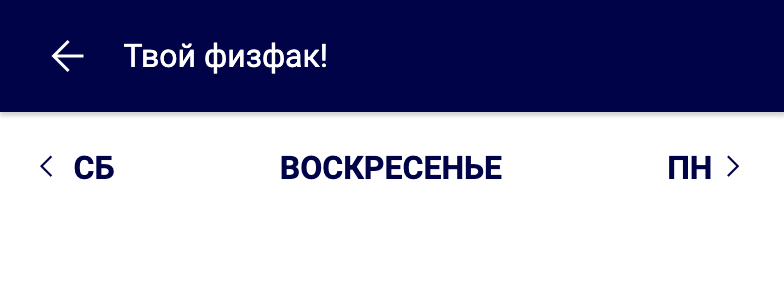
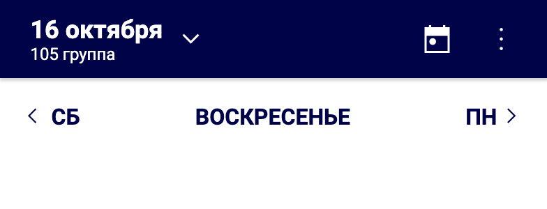

# navbar-element
Данный микросервис отвечает за навигационные панели в приложении. В него включены как основная
панель, так и верхняя. При разработке микросервис запускается на порте 9001.

# Основна панель
Основная панель отвечает за переключение между остальными микросервисами приложения. Код панели
пишется в файле NavbarMain.vue. Так как приложение должно работатб, как на мобильных устройствах,
так и десктопе, мы используем 2 различных макета NavbarDesktop.vue и NavbarMobile.vue. Однако вся
логика сервиса прописывается в NavbarMain, а в макеты передаётся только с помощью props. Сделано это
для того, чтобы поведение навбаров было одинаковым независимо от макета, а также чтобы избежать
дублирования кода.

# Верхняя панель
Данная панель выступает в роли вспомогательной, в отдельных микросервисах. Есть несколько
размеченных наборов кнопок, которые активируются в зависимости от значения pageId. Каждой странице
в приложении присвоено своё значение pageId и при монтировке страницы оно передаётся с помощью
события "сhange-page".

## Использование в сервисе
Для изменения навбара из вашего сервиса нужно отправить JS событие `change-header-layout` с типом
навбара и настройками. Пример события:

```js
let changeHeaderLayoutEvent = new CustomEvent("change-header-layout", {
    detail: {
        layoutName: "calendar",
        text: "Твой физфак!",
        groupInfo: this.groupInfo,
        disabled: false,
        menu: [
            {
                name: "Изменить группу",
                action: () => {
                    this.loaded = false;
                    this.groupId = undefined;
                    this.groupInfo = {number: ''};
                    this.timetable = [];
                    localStorage.removeItem("timetable-group-id");
                    localStorage.removeItem("timetable-group-info");
                    localStorage.removeItem("timetable-cache");
                    this.$router.push("/timetable/init");
                },
            },
        ],
    },
});
document.dispatchEvent(changeHeaderLayoutEvent);
```

## Варианты использования
Доступные варианты навбаров:
| Image                              | Layout name | Params                                                                                                                                                                                                           |
| ---------------------------------- | ----------- | ---------------------------------------------------------------------------------------------------------------------------------------------------------------------------------------------------------------- |
|        | `plain`     | `text` – текст, `menu` – элементы меню (см. дальше)                                                                                                                                                              |
|          | `back`      | `text` – текст, `menu` – элементы меню (см. дальше)                                                                                                                                                              |
|  | `calendar`  | `groupInfo` – информация о группе, для которой показывается расписание (необязательный), `disabled` – включены ли кнопки, `text` – текст вместо даты, если кнопки выключены, `menu` – элементы меню (см. дальше) |

## Кнопки меню
Все навбары поддерживают выпадающее меню под тремя точками. Для их использования надо передать
массив элементов в формате:
```js
{
    menu: [
        {
            name: "Изменить группу",
            action: () => {...},
        },
    ]
}
```
`name` – текст на кнопке
`action` – функция без параметров, которая будет выполнена при нажатии на кнопку

**Важно!** Тут можно использовать *this* параметры, что позволит вам изменять параметры компонента,
откуда создается навбар, напрямую из функции.

## Project setup
```
yarn install
```

### Compiles and hot-reloads for development
```
yarn start
```

### Compiles and minifies for production
```
yarn run build
```

### Lints and fixes files
```
yarn run lint
```

### Customize configuration
See [Configuration Reference](https://cli.vuejs.org/config/).
